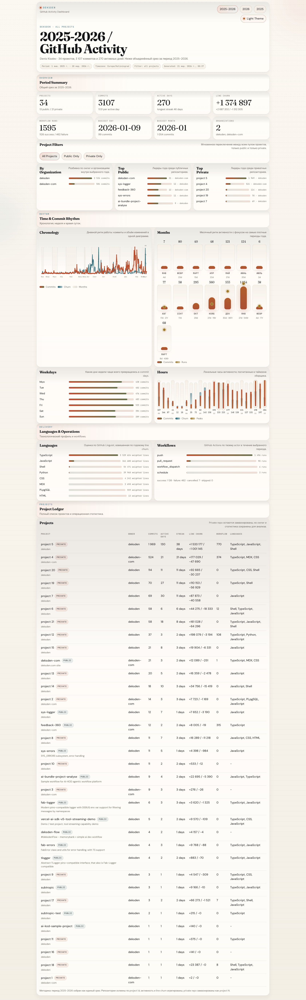
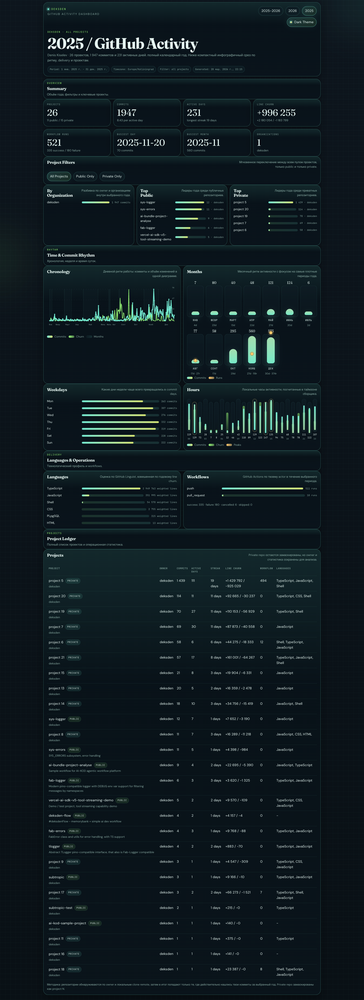

# dd-stats

Standalone GitHub activity collector and dashboard for Deksden.

The project gathers commit-level activity from GitHub and local clones, exports yearly JSON snapshots, builds a SQLite snapshot for easier querying, and generates a static dashboard for:

- `2025`
- `2026`
- `2025-2026` as one combined period

Private repositories stay masked in the dashboard as `project N`.

## Preview

Combined `2025-2026` screen:



Year detail screen in dark theme:



## Quick Start

```bash
npm run dashboard
npm run serve
```

Open `http://localhost:4173`.

`npm run serve` uses the built-in Node static server from `scripts/serve.mjs`.

For a full refresh of data plus dashboard:

```bash
npm run build
```

## What It Does

- discovers repositories through `gh` and local Git remotes
- prefers local clones for precise `git log --numstat` stats
- falls back to GitHub data where needed
- exports yearly snapshots to JSON
- exports an aggregated SQLite database
- builds a static dashboard with light/dark themes

## Metrics

The project tracks:

- projects worked on
- commits
- active days
- longest streaks
- additions / deletions / net lines
- chronology
- monthly activity
- weekday activity
- hour-of-day activity
- language distribution
- workflow runs
- organization breakdown

## Project Layout

```text
config/
  activity.config.json
data/
  2025.json
  2026.json
  github-activity.sqlite
dist/
  index.html
  year-2025.html
  year-2026.html
scripts/
  fetch-github-activity.mjs
  export-activity-sqlite.mjs
  build-dashboard.mjs
src/
  dashboard-app.js
  dashboard.css
```

## Requirements

- Node.js 25+
- GitHub CLI (`gh`) authenticated
- Python 3 for local static serving

## Commands

```bash
npm run collect
```

Collects GitHub activity and writes yearly JSON snapshots plus a SQLite snapshot.

```bash
npm run sqlite
```

Rebuilds the SQLite snapshot from existing JSON files.

```bash
npm run dashboard
```

Builds the static dashboard into `dist/`.

```bash
npm run build
```

Runs a full data collection for `2025` and `2026`, then rebuilds the dashboard.

```bash
npm run serve
```

Serves the dashboard locally on `http://localhost:4173`.

## Configuration

Main config file:

[`config/activity.config.json`](./config/activity.config.json)

Default setup currently uses:

- timezone: `Europe/Kaliningrad`
- years: `2025`, `2026`
- local repo roots:
  - `~/Documents/_Projects`
  - `~/Documents/GitHub`

## Outputs

- yearly raw snapshots:
  - [`data/2025.json`](./data/2025.json)
  - [`data/2026.json`](./data/2026.json)
- SQLite snapshot:
  - [`data/github-activity.sqlite`](./data/github-activity.sqlite)
- static dashboard:
  - [`dist/index.html`](./dist/index.html)
  - [`dist/year-2025.html`](./dist/year-2025.html)
  - [`dist/year-2026.html`](./dist/year-2026.html)

## Notes

- `index.html` is the combined `2025-2026` screen.
- year pages reuse the same dashboard structure as the combined screen.
- private repositories are anonymized in `dist/`, while owner-level aggregates remain available.
- JSON is convenient for the static frontend, SQLite is convenient for ad hoc analysis and future updates.
